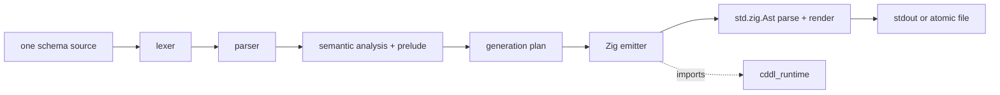

# Architecture

`cddl-zig` is one package with three components and no package dependencies.

| Path | Module | Responsibility |
|---|---|---|
| `src/compiler/` | `cddl_zig.compiler` | Lexing, parsing, semantic normalization, generation planning, and Zig emission |
| `src/runtime/` | `cddl_runtime` | Strict CBOR decode/validate and deterministic encode |
| `src/cli/`, `src/main.zig` | `cddl-zig` | Arguments, file/stdin I/O, diagnostics, atomic output, and exit status |

The runtime does not import the compiler. The compiler embeds the generated-code
support template as text and does not import the runtime. Generated modules import
the runtime by module name and check its ABI at compile time.

## Pipeline



### Source and diagnostics

The CLI accepts one file or stdin. Input bytes are retained unchanged and bounded
by `--max-input-bytes`. Every diagnostic span is a half-open byte range in that
single source, so file name, byte offset, line, and byte column remain exact.

The lexer always advances on malformed input. The parser owns decoded literal and
tree storage but borrows the source bytes. Diagnostics are retained up to
`--max-errors`; a zero limit means unlimited retention while the total count is
still tracked.

### Semantic model

Semantic analysis parses the RFC 8610 Appendix D prelude through the same frontend
as user rules. It resolves forward references, duplicate definitions,
augmentations, sockets, groups, generic instantiations, ranges, heads, and the
supported RFC 8610 control vocabulary.

The resulting `Model` owns an arena containing rule names, literals, normalized
nodes, instantiations, occurrences, keys, and source origins. It is independent of
the AST and source text. Empty ranges become an empty choice. Operations that
depend on generic parameters are deferred until a concrete instantiation.

### Generation plan

Planning walks every concrete named type rule in source order and marks the exact
normalized graph needed by generated code. It also:

- assigns PascalCase public names and snake_case field names;
- flattens supported array/map groups;
- preserves occurrence bounds;
- identifies native scalar choices;
- calculates supported `.size` controller bounds;
- reports the normalized node responsible for an unsupported mapping.

Recursion, group alternatives, repeated group splices, dynamic/repeated map keys,
and unsupported control/head forms are hard planning errors. The CLI maps them to
stable `E05xx`/`E06xx` diagnostics at the node's source span.

### Emission

The emitter writes declarations, a compact descriptor graph, and the private codec
template. It then parses the result with `std.zig.Ast` and returns Zig's rendered
source. A generated syntax failure is internal error 70, never a schema error.

The output order is source order or a defined numeric order. Hash-map iteration
never controls emitted bytes.

## Generated codec design

Public values use native Zig layouts. The generated private descriptor graph is
the single schema predicate used by validation, encoding, and decoding.

- `validate` converts the native value into an arena-backed runtime value and
  applies the descriptor matcher.
- `encode` follows the same path, then calls the deterministic runtime encoder.
- `decode` parses one complete runtime value, applies the matcher, and materializes
  the public native value in an arena owned by `Decoded`.

This shared path prevents encode/decode constraint drift. The runtime `Value` is
an implementation detail except where a representation head has no more specific
native form.

Every matcher traversal has a depth bound. Runtime decode additionally enforces
configured depth, item, string, cumulative-allocation, and work limits.

## Runtime

`cddl_runtime` exports:

- `Decoder`, `Encoder`, and `Value`;
- `decodeValue`, `validate`, and `encodeValueAlloc`;
- `DecodeOptions` and `Limits`;
- unified `Error` plus decode/encode classifications;
- `abi_version` and embedded runtime sources.

The decoder accepts valid non-preferred encodings unless
`require_deterministic = true`. It rejects malformed input, invalid UTF-8,
duplicate equivalent map keys, trailing bytes, and exceeded limits. The
allocation limit is cumulative during one decode; free and shrink do not refund
it because an arena may not release backing storage.

The encoder uses preferred integer/length widths, shortest exact float widths,
preserves NaN sign and payload, and applies RFC 8949 core deterministic map-key
ordering.

## CLI I/O

| Command | I/O behavior |
|---|---|
| `check` | Reads and compiles one schema; writes diagnostics only |
| `generate` | Writes stdout or atomically replaces one file after complete success |
| `generate --check` | Compares an existing output and writes nothing |
| `runtime` | Creates a directory and atomically updates each embedded runtime file |
| `runtime --check` | Compares all expected runtime files and writes nothing |
| `explain` | Prints one catalog entry |

Existing output is not rewritten when its bytes already match. On any schema or
planning diagnostic, generation writes no output.

Human diagnostics use one line per item. JSON diagnostics are one valid document
for the complete schema command:
`{"diagnostics":[...],"total":N,"omitted":N,"error":null|string}`. Operational
failures use `error`; compiler findings remain in `diagnostics`. `--color=auto`
requires a terminal and honors `NO_COLOR`.

Exit codes:

| Code | Meaning |
|---|---|
| 0 | success |
| 1 | schema or generation diagnostic |
| 2 | command-line usage, unknown diagnostic code, or output aliases input |
| 3 | stale/missing `--check` output |
| 4 | I/O failure or input limit exceeded |
| 5 | out of memory |
| 70 | internal invariant failure |

## Ownership

- Compiler `Ast` and `Model` have explicit `deinit` methods.
- `generate` returns allocator-owned bytes.
- Runtime `decodeValue` returns an owned value released with `Value.deinit`.
- Generated `decode` returns `Decoded`; all nested data is valid through
  `Decoded.deinit` and does not borrow input bytes.
- Generated `encode` returns allocator-owned bytes.
- No compiler, runtime, or generated API uses global mutable state.

## Verification

The build exposes:

```sh
zig build fmt-check
zig build test
zig build
```

Unit tests cover frontend recovery and allocation failures, semantic ownership,
planning boundaries, deterministic emission, CLI file/stdin behavior, runtime
malformed input, deterministic CBOR, resource limits, and allocation accounting.
A release smoke test must also compile generated Zig against the vendored runtime
and execute an encode/decode/re-encode round trip.
