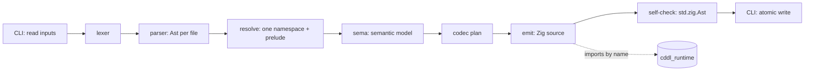

# Architecture

`cddl-zig` turns CDDL into Zig source: a native type and a strict CBOR codec for each
rule. The generated code links against a small runtime that does not depend on any
schema. The project targets Zig 0.16.x, uses only the standard library, and has no
package dependencies.

Related documents:

- [standards.md](standards.md): which constructs are supported and what happens for
  the rest.
- [mapping.md](mapping.md): the exact Zig form of every construct.

## Components

| Path | Module | Responsibility | I/O |
|---|---|---|---|
| `src/compiler/` | `cddl_zig` (`src/root.zig` exports `compiler` and `runtime_abi`) | Sources, diagnostics, lexing, parsing, name resolution, semantic analysis, codec planning, Zig emission. | None. Callers pass in byte slices, and the compiler returns data. |
| `runtime/` | `cddl_runtime` (`runtime/cddl_runtime.zig`) | Reading and writing CBOR without a schema, the generic `Value`, data-model equality, limits, and error classification. | No files or processes. Output goes to a fixed buffer or a `std.Io.Writer` the caller provides. |
| `src/cli/`, `src/main.zig` | executable `cddl-zig` | Argument parsing, reading files and stdin, rendering diagnostics, atomic output, exit status. | All process and file I/O happens here. |
| `build.zig` | — | Publishes `cddl_zig` and `cddl_runtime`, and gives the executable the private `build_options` module (with `version`). | — |

Modules import one another by module name only, never by a relative path that
crosses a module root. The runtime does not import `cddl_zig`, and the compiler does
not import the runtime.

## Pipeline

| Stage | Input | Output | Invariants |
|---|---|---|---|
| Sources | Bytes read by the CLI, each up to `--max-input-bytes` | `Source { name, text }`, borrowed | Bytes are kept exactly as read. No newline or Unicode normalization. |
| Lexer | One `Source` | Tokens with half-open byte `Span`s | Strict RFC 9682 Appendix A character classes. Every error advances at least one byte. Tokens borrow source text. |
| Parser | Tokens | `Ast` for one file, which owns its tree storage and decoded literals | Keeps source order, spans, parenthesized ambiguity (`(b)` may be a type or a group), occurrence bounds, cuts, member-key forms, control operators, generic arguments, and RFC 9682 head numbers. Recovery inserts zero-width placeholders that are marked invalid. |
| Resolve | Every `Ast`, in argument order | Symbol tables and dependency graph | Prelude added after user rules. Duplicate-definition and augmentation checks. Sockets. A sort (type or group) assigned to each rule. Generic parameters bound lexically. |
| Sema | Symbols | Semantic model | Validates operands through the control registry. Folds constants. Computes value sets (integer ranges, singletons, emptiness). Finds strongly connected components and non-productive cycles. Selects the root. Reports unsupported constructs. Never runs if earlier stages reported errors. |
| Codec plan | Semantic model | One plan per emitted type: storage shape, matcher program, checks | The only description of matching semantics. The decoder and the encoder are both generated from it. |
| Emit | Codec plan | Zig source bytes | Naming, ordering, header, ABI check (see [mapping.md](mapping.md)). Output is parsed with `std.zig.Ast`. A parse error there is an internal error, not a schema diagnostic. |
| Write | Source bytes | File or stdout | Only after the whole run succeeds. An identical file is not rewritten. A different one is replaced atomically. |

### Semantic model

The semantic model keeps everything the matcher needs:

- Ordered type choices and ordered group choices, in source and plug order.
- Occurrence bounds as `(min, max)` with `max` either a number or unbounded.
- Member keys as one of bareword, value, or type, with a cut flag.
- Exact constants: integers covering `-2^64..2^64-1`, binary64 floats with their
  bits preserved, and text and byte strings.
- A link from every node back to its source span, plus the instantiation chain.

Lowering never replaces a construct with `any`, drops a control, or widens an
occurrence. When exact lowering is not available, the construct gets an
unsupported diagnostic instead.

### Control operator registry

A static table in `src/compiler/` lists every control operator name the compiler
knows. Each row has the defining document, the status (supported, folded,
annotation, unsupported), the operand categories it accepts, and the lowering hook.
Lookup is case-sensitive. An unknown name is an unsupported diagnostic. The
registry is the single source of truth for the operator tables in
[standards.md](standards.md), and a test checks that the two agree.

### Codec plan

A plan has two parts:

- **Storage shape:** the Zig type, worked out from the mapping rules.
- **Matcher program:** PEG operations (sequence, ordered choice, greedy
  occurrence, map entry with an optional cut), leaf predicates (kind, literal,
  range, size, bits, tag, regexp program), and derived-item checks. A derived-item
  check runs a controller's matcher over a CBOR item the codec builds itself, which
  is how `.cbor`, `.cborseq`, `.json`, `.base10`, the base-N operators, and
  container-valued `.and` and `.within` work.

The decoder runs the matcher over input bytes and fills in storage. The encoder
lays the value out as a sequence of items, checks it with the same matcher, and
then writes it. Choice selection probes the input without allocating, and only
the selected alternative is materialized.

## Runtime

`cddl_runtime` exposes `abi_version: u32 = 1` together with `Encoder`, `Decoder`,
`DecodeOptions`, `Limits`, `Value`, and the error sets `DecodeError`,
`EncodeError`, and `Error`.

- `DecodeOptions { limits: Limits, require_deterministic: bool = false }`.
- `Limits { max_depth, max_items, max_string_bytes, max_allocation_bytes, max_work }`.
  All have finite defaults. Work counts the bytes examined plus the cost of key
  sorting and canonicalization, and is charged on every path a choice tries.
- `Decoder.init(allocator, input, options)`. Every runtime allocation goes through
  a wrapper that charges the allocation budget. A decode that fails releases its
  own partial allocations. `Decoder.error_offset` records where a failure
  happened.
- `Encoder` holds no allocator. It is created with `initWriter(*std.Io.Writer)`,
  `initFixed([]u8)`, or `initList(gpa, *std.ArrayList(u8))`. Any call that needs
  scratch memory takes an allocator argument and frees that memory before it
  returns. `MapBuilder` collects map entries whose keys are only known at run
  time, sorts them by encoded key bytes, and rejects keys that are equivalent
  under Section 5.6.1.
- `Value` variants: `integer: i65`, `bytes`, `text`, `array`, `map` (entries with
  `key` and `value`), `tag { number: u64, content }`, `simple: u8`, `boolean`,
  `null`, `undefined`, and `float: f64`.
- `errorKind(err)` puts every runtime error in exactly one class:

| Class | Meaning | Examples |
|---|---|---|
| `malformed` | Not well-formed under RFC 8949 Section 3 / Appendix F, or input left over | `UnexpectedEndOfInput`, `ReservedAdditionalInfo`, `UnexpectedBreak`, `TrailingBytes` |
| `invalid` | Well-formed but invalid under Section 5.3.1 | `InvalidUtf8`, `DuplicateMapKey` |
| `nondeterministic` | Breaks Section 4.2.1; raised only with `require_deterministic` | `NonPreferredArgument`, `UnsortedMapKeys` |
| `schema_mismatch` | Valid CBOR that the CDDL does not match | `TypeMismatch`, `MissingMapKey`, `NoMatchingChoice` |
| `limit` | A `Limits` bound was hit | `DepthLimitExceeded`, `WorkLimitExceeded` |
| `allocation` | The allocator failed | `OutOfMemory` |
| `output_capacity` | The output sink ran out of room or failed | `OutputCapacityExceeded`, `WriteFailed` |

The first three classes together are "malformed CBOR" in the project-wide error
contract. A failure inside one choice alternative is a `schema_mismatch` for that
alternative. Any other class stops the whole decode and is never turned into
`NoMatchingChoice`.

### ABI

- Generated code checks `rt.abi_version == 1` in a `comptime` block. A mismatch is
  a compile error.
- `cddl_zig.runtime_abi` equals `cddl_runtime.abi_version`, and a test asserts it.
- `abi_version` increases on any change to the runtime API that generated code
  uses.
- `cddl-zig runtime` writes the runtime source byte for byte as it is embedded in
  the executable, so that a project can vendor it.

## Generated ownership model

The full rules are in [mapping.md](mapping.md#ownership). In short:

- Decoding takes a `*std.heap.ArenaAllocator`. Containers, joined indefinite
  strings, recursion links, and `Value` trees are allocated in the arena.
  Definite-length strings borrow the input. Generated code never frees, so a
  failed decode leaves nothing behind once the arena is released.
- Encoding takes `*const` values and never changes them. Scratch memory comes from
  an allocator argument and is freed before `encode` returns.
- Nothing is cached in global or thread-local state. Every allocation goes through
  an allocator the caller supplied.

## Deterministic output contract

| ID | Guarantee |
|---|---|
| D1 | The same input bytes, argument order, and options produce byte-identical output on every run, optimize mode, host OS, host pointer width, and allocator. |
| D2 | The output never contains a timestamp, absolute path, environment value, host property, allocator address, or generator version. The header holds input basenames, the runtime ABI, and a SHA-256 of the inputs. |
| D3 | Output order comes from source order or an explicit total order. Hash-map iteration order never decides anything. |
| D4 | The output is ASCII, uses LF line endings, contains no tabs and no trailing whitespace, ends with exactly one `\n`, and is unchanged by `zig fmt`. Non-ASCII literal content is escaped. |
| D5 | Generated code depends on no host property: wire values use fixed-width integers, never `usize`, and byte order is explicit. |
| D6 | Diagnostics come out in a deterministic order with stable wording and no addresses. |
| D7 | If any error is reported, nothing is written. Otherwise the output is written once, or not at all when the file is already identical. |

## Diagnostics principles

Every diagnostic has:

- A **code**: `E` (error) or `W` (warning) followed by four decimal digits. The
  compiler's `Code` enum names correspond one-to-one with the numbered catalog
  that `cddl-zig explain` shows. A code is never renumbered, reused, or given a
  different meaning; a retired code stays reserved.
- A **primary span**: a source and a half-open byte range. Insertion points use a
  zero-width span.
- A **message**: static or deterministically formatted text, with no pointers.
- Optional **related spans and notes**, such as the other definition of a
  duplicate, the use site of a group used as a type, or the generic instantiation
  chain.

| Code range | Area |
|---|---|
| 0001–0099 | Input bytes and encoding |
| 0100–0199 | Lexical |
| 0200–0299 | Syntax |
| 0300–0399 | Names and structure: undefined, duplicate, cycles, generics, sockets |
| 0400–0499 | Semantics and constraints: controls, ranges, literals, operands |
| 0500–0599 | Unsupported constructs |
| 0600–0699 | Code generation: names, opaque rules, generation limits |
| 0700+ | Reserved |

Rules:

1. Unsupported constructs are always errors. Warnings never change what the
   generated code accepts; `--deny-warnings` changes only the exit status.
2. Recovery never makes a schema more permissive. A tree that contains syntax
   errors is never lowered or generated from. Follow-on errors caused only by an
   error placeholder are suppressed.
3. Diagnostics are sorted by source index, start offset, end offset, code, and
   message. Notes stay with their parent in insertion order.
4. Each run keeps at most `--max-errors` diagnostics and still counts every one
   (default 50; 0 means unlimited). The summary reports how many were omitted.
5. Running out of memory is an error return (exit 5), never a diagnostic.
   Generated code that fails its self-check is an internal error (exit 70).
6. Exit status: 0 for success, 1 for schema errors or denied warnings, 2 for usage,
   3 for a stale `--check`, 4 for I/O, 5 for out of memory, and 70 for an internal
   error.

## Compiler resource limits

Every limit is explicit, so neither recursion nor arithmetic depends on input
size. Exceeding a limit produces a diagnostic, never a crash, overflow, or
truncation.

| Resource | Bound |
|---|---|
| Input bytes per file | `--max-input-bytes`, default 16 MiB, enforced before parsing. |
| Syntax nesting depth | Parser option, enforced before recursing. |
| AST nodes | Parser option. |
| Generic instantiations (count and depth) | Sema limit. The diagnostic shows the instantiation chain. |
| Folded constant size (`.cat`, `.det`, `.printf`, `.join`) | Sema limit, checked before allocating. |
| Regexp program size and `{n,m}` expansion | Sema limit. |
| Diagnostics kept | `--max-errors`. |

All size arithmetic is checked before allocation, indexing, or conversion to a
wire length.

## Release acceptance gates

A release is tagged only when every gate passes on Zig 0.16.0 with no package
dependencies.

| Gate | Requirement |
|---|---|
| G1 Build | `zig build`, `zig build test`, and `zig build fmt-check` pass on Linux, macOS, and Windows. |
| G2 Standards matrix | Every Supported row in [standards.md](standards.md) has positive, boundary, and negative fixtures. Every Unsupported row has a fixture that produces its `E05xx` code at the expected span and writes no output. The control registry and the operator tables agree. |
| G3 CBOR vectors | Every RFC 8949 Appendix A example decodes, and re-encodes to the same bytes where it is in deterministic form. Every Appendix F example is rejected as `malformed`. |
| G4 Adversarial wire input | Rejected precisely: truncation at every byte boundary, reserved additional information, a lone break, `f8 00` through `f8 1f`, nested or wrong-major indefinite chunks, UTF-8 errors within a chunk, duplicate keys that differ only in width or in the sign of zero, trailing bytes, and length or depth bombs (before any allocation). Deterministic-input mode rejects every nonpreferred form. |
| G5 Integer and float domains | `1b ffffffffffffffff` and `3b ffffffffffffffff` round-trip through `int`. Floats round-trip at the shortest width, `-0.0` keeps its sign, and NaN payloads are preserved. The ordering of map keys `100` and `-1` matches Section 4.2.1. |
| G6 Generated code | Each generation fixture compiles in Debug, ReleaseSafe, ReleaseFast, and ReleaseSmall, and for at least one 32-bit target and one big-endian target. Every declaration is forced to be analyzed. No `@intCast`, `@enumFromInt`, or `unreachable` is applied to a wire-derived value. |
| G7 Round trip | Properties R1–R3 from [mapping.md](mapping.md#round-trip-guarantees) hold for every generation fixture. Encoding is validated against decoding: `encode` fails exactly when the bytes it would produce do not match the schema. |
| G8 Memory | Every allocation-failure index in `generate` and in each fixture's `decode` and `encode` returns `OutOfMemory` without leaking. Fixed-shape schemas encode and decode with an allocator that always fails. |
| G9 Fuzzing | The lexer, parser, generator pipeline, runtime decoder, and each fixture's `decode` never panic, stay within their limits, and report spans inside the source. |
| G10 Determinism | D1–D7 are checked by generating every fixture with Debug, ReleaseFast, and 32-bit builds of the generator and comparing the bytes. |
| G11 Diagnostics | Every non-internal code appears in at least one fixture's expected diagnostics. Golden output is checked byte for byte in both the human and JSON formats. |
| G12 Documentation | `README.md`, these documents, the diagnostic catalog, and `CHANGELOG.md` match the released behavior. |
